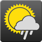
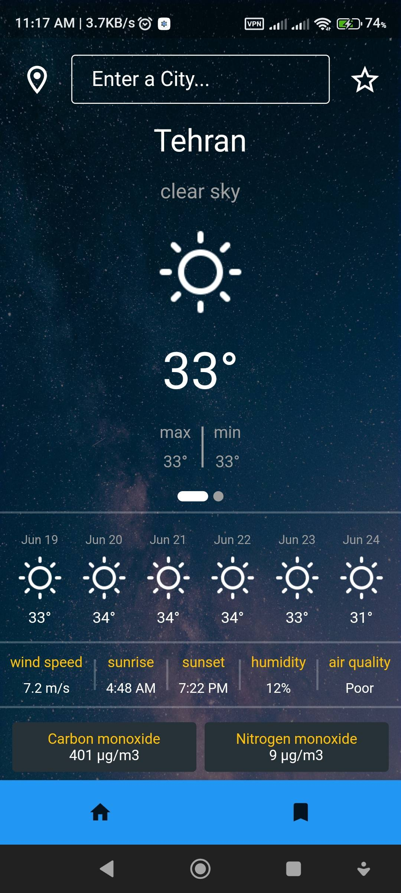
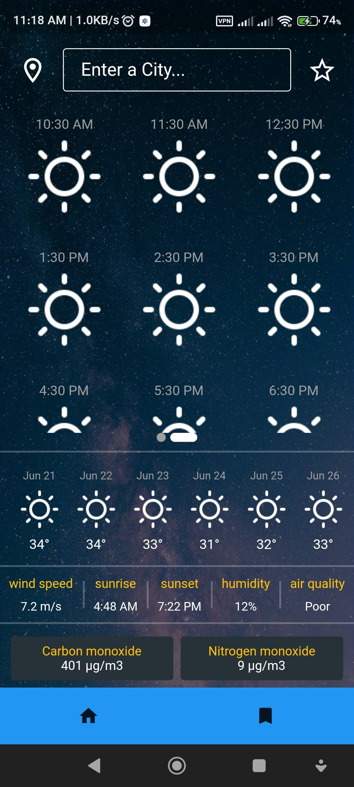
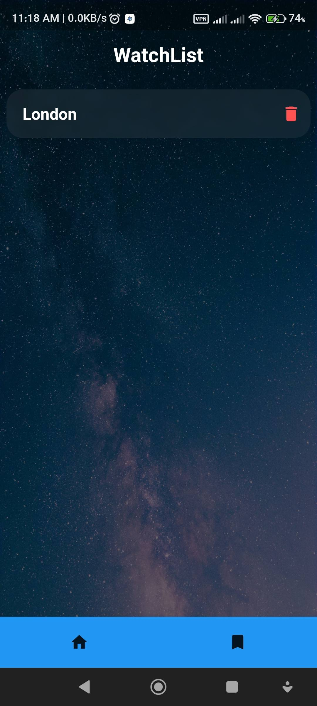

# HIIT   

<a href="https://github.com/vahid6889/HIIT/blob/master/assets/hiit-armeabi-v7a.apk">hiit-armeabi-v7a.apk</a>
<a href="https://github.com/vahid6889/HIIT/blob/master/assets/hiit-arm64-v8a.apk">hiit-arm64-v8a.apk</a>
<a href="https://github.com/vahid6889/HIIT/blob/master/assets/hiit-x86_64.apk">hiit-x86_64.apk</a>

How is it weather ?

  
  
  

Features of the weather forecasting Flutter project:
- Clean Architecture
- Bloc statement
- Featured folder structure
- Responsive view screens
- Testable
- Provided details bloc with Getit
- TDD
- Lint

The packages used in the project:
- Flutter bloc
- Bloc
- Shared preferences
- Floor
- Dio
- Intl
- Get-it
- Smooth page indicator
- Mockito
- Bloc_test
- Location
- Flutter typeahead
- Loading animation widget

## Getting Started

This project is a starting point for a Flutter application.

A few resources to get you started if this is your first Flutter project:

- [Lab: Write your first Flutter app](https://docs.flutter.dev/get-started/codelab)
- [Cookbook: Useful Flutter samples](https://docs.flutter.dev/cookbook)

For help getting started with Flutter development, view the
[online documentation](https://docs.flutter.dev/), which offers tutorials,
samples, guidance on mobile development, and a full API reference.
